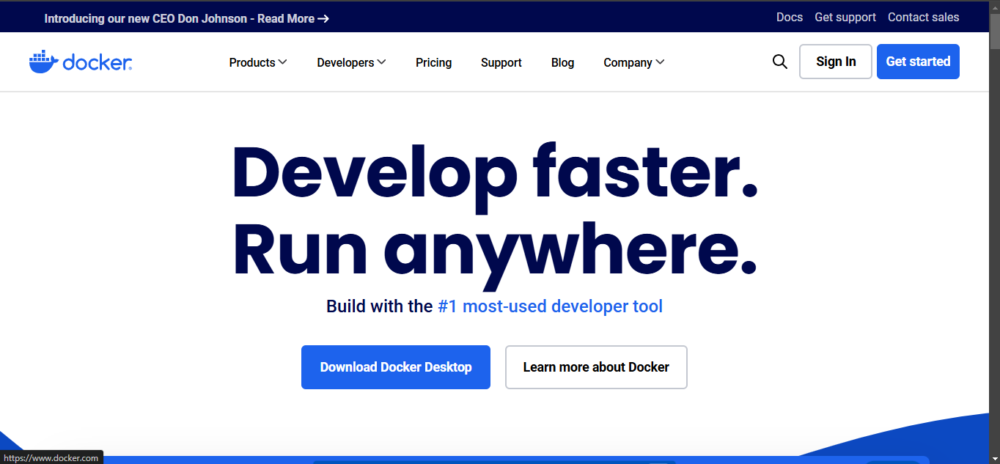
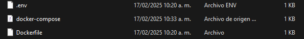
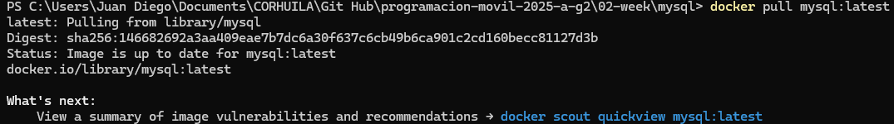
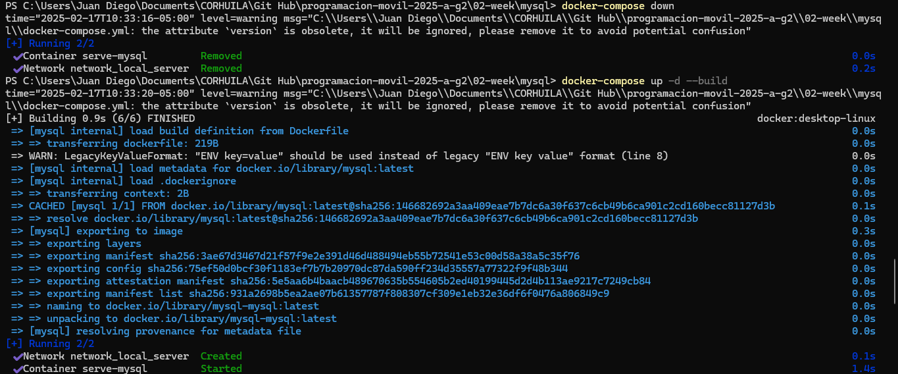
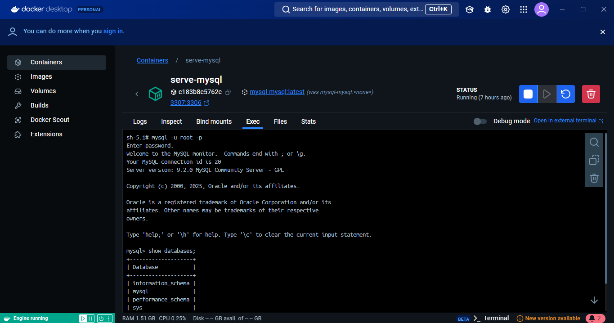

# Configuración del contenedor

En esta documentación se describe el paso a paso la configuración del ambiente del contenedor.

## Primer paso: Instalación del Docker

Es necesario instalar Docker en nuestro sistema operativo. Se puede descargar e instalar Docker desde su sitio web oficial. 



## Segundo paso: Creación de un archivo Dockerfile

Una vez intalado Docker, creamos un archivo llamado Dockerfile en la carpeta raíz del repositorio. Este archivo fue sumistrado por el docente junto con otros dos archivos: **.env** y **docker-compose.yml**.



## Tercer paso: Descarga la imagen de MySQL

Para esto, abrimos la consola o terminal en la carpeta del repositorio y ejecuetamos el siguiente comando para descargar la imagen más reciente de MySQL:

```bash
docker pull mysql:latest
```


## Cuarto paso: Creación y ejecución del contenedor

Una vez descargada la imagen, se crea un contenedor basado en ella. Es importante asegurarse de estar en la carpeta que contiene los archivos **.evn, docker-compose.yml** y **Dockerfile**, y se ejecuta el siguiente comando:

```bash
docker-compose dow
docker compose up -d --build
```


## Quinto paso: Verificación del acceso a MySQL

Se comprueba el acceso a MySql utilizando la consola:

