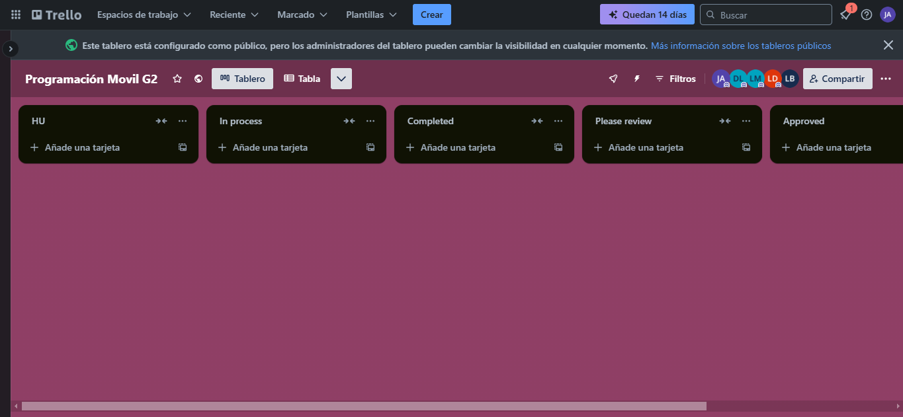
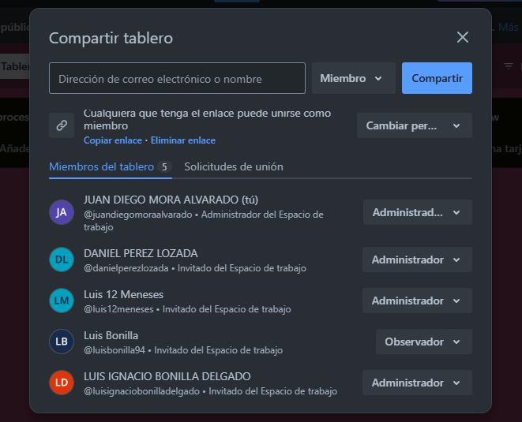

# Adecuación de Trello

En este espacio se muestra la configuración de Trello.

## Primer paso: Registro en Trello

Se accede la página principal de [Trello](https://trello.com/es) y se hace el registro con el correo institucional.

## Segundo paso: Crear las listas

Se crean las listas especificadas por el docente:
- HU
- In Process
- Completed
- Please Review
- Approved

## Tercer paso: Agregar administradores

Se agregan a los 3 miembros del equipo los cuales desarrollarán tareas y supervisarán su correcta ejecución.

## Cuarto paso: Enlace proyecto Trello

Se adjunta el enlace del tablero de Trello desarrollado en clase para facilitar el acceso y seguimiento del proyecto.

[Enlace al tablero de Trello](https://trello.com/invite/b/67b497c3e104dd0d5fa913e9/ATTI44ae05dabee0197ae9d2237c44c2001e4FB1006F/programacion-movil-g2)