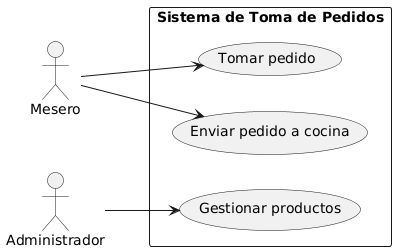
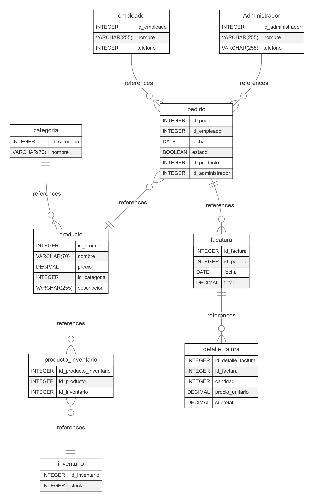
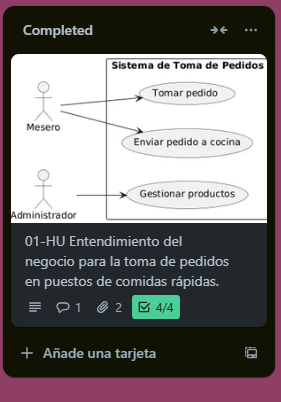
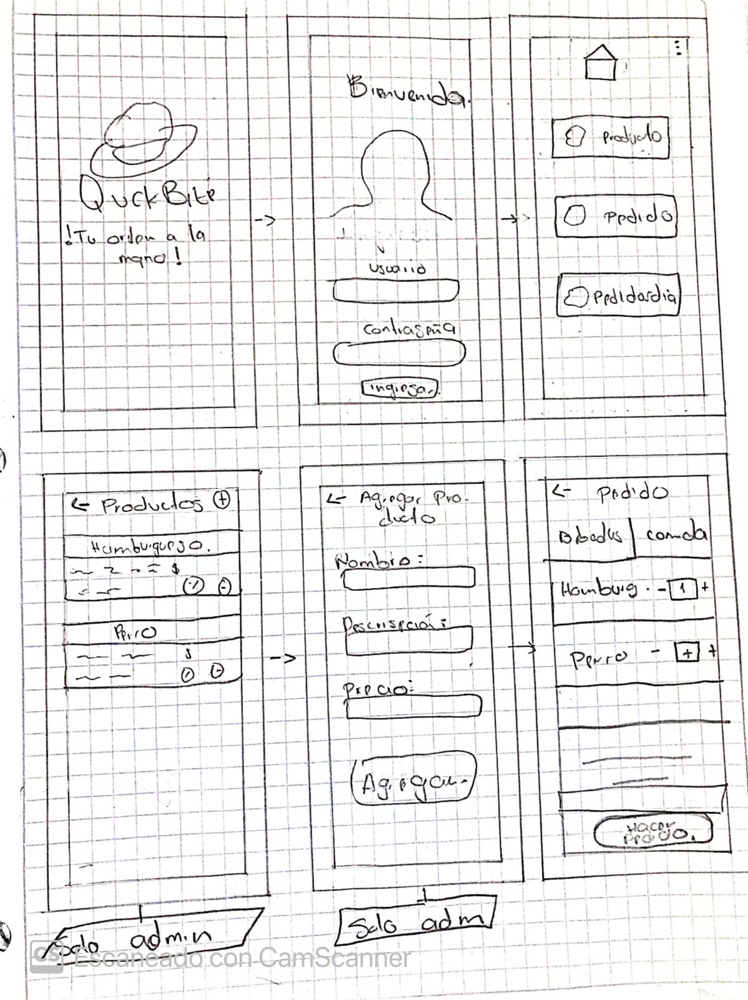
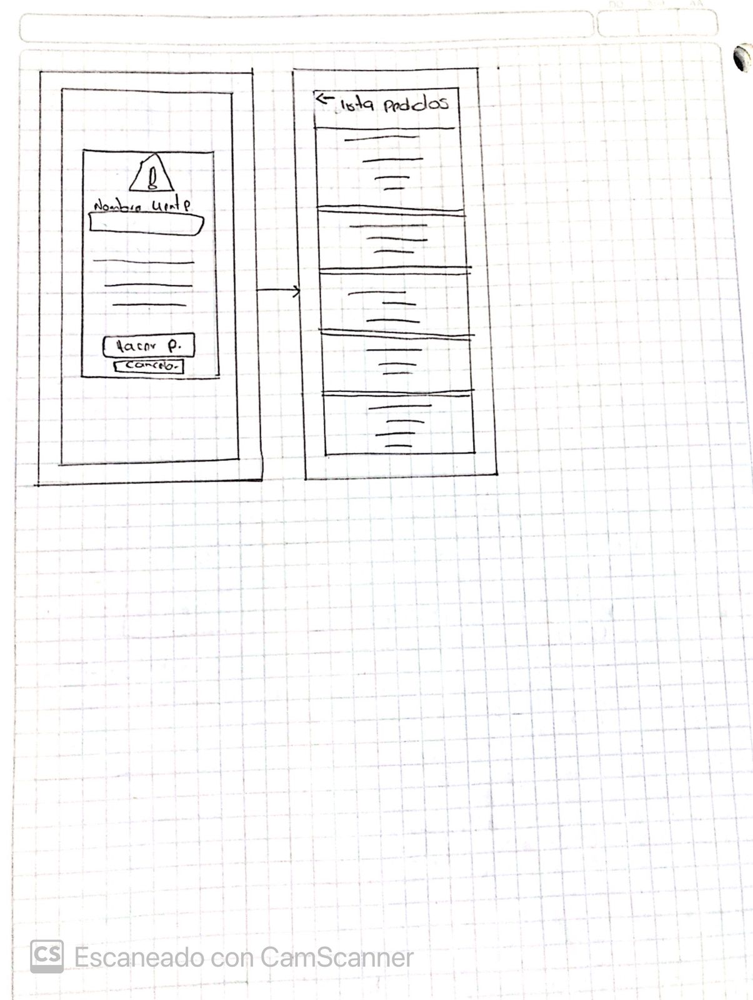
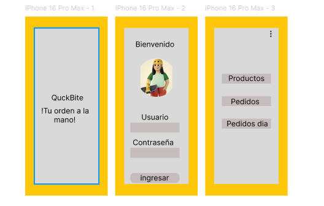
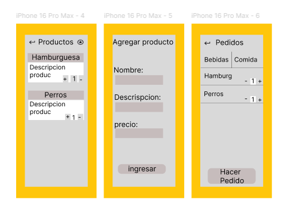
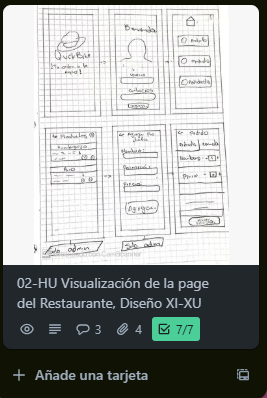

# Proceso Historias de Usuarios

En este espacio se muestra el proceso que se ha desarrollado hasta el momento en trello con respecto al proyecto.

## Primer paso: Entendimiento de negocio

Se analiza y se da comprensión al planteamiento de negocio para la toma de pedidos en puestos de comidas rápidas.

Con ayuda de diagramas de base de datos y caso de uso, se definieron roles y la arquitectura de la base de datos.

- Diagrama caso de uso:

- Diagrama base de datos:

Se da por completada la primera Historia de Usuario 01-HU

## Segundo paso: Visualización de la page

Se diseña un Mockup a mano para después realizarlo en Figma.

- Mockup a mano:

- Mockup en Figma:

Se da por completada la segunda Historia de Usuario 02-HU

