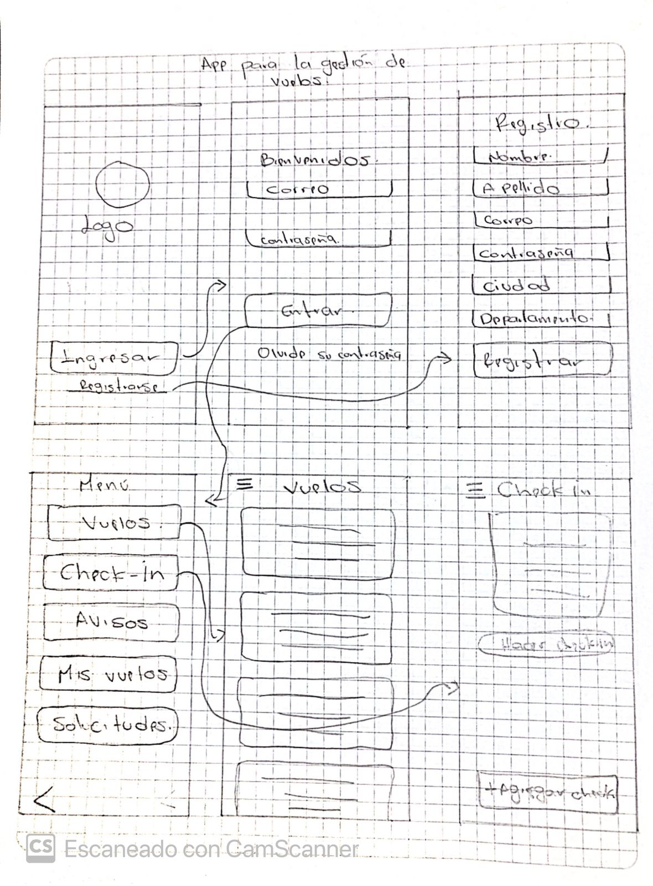
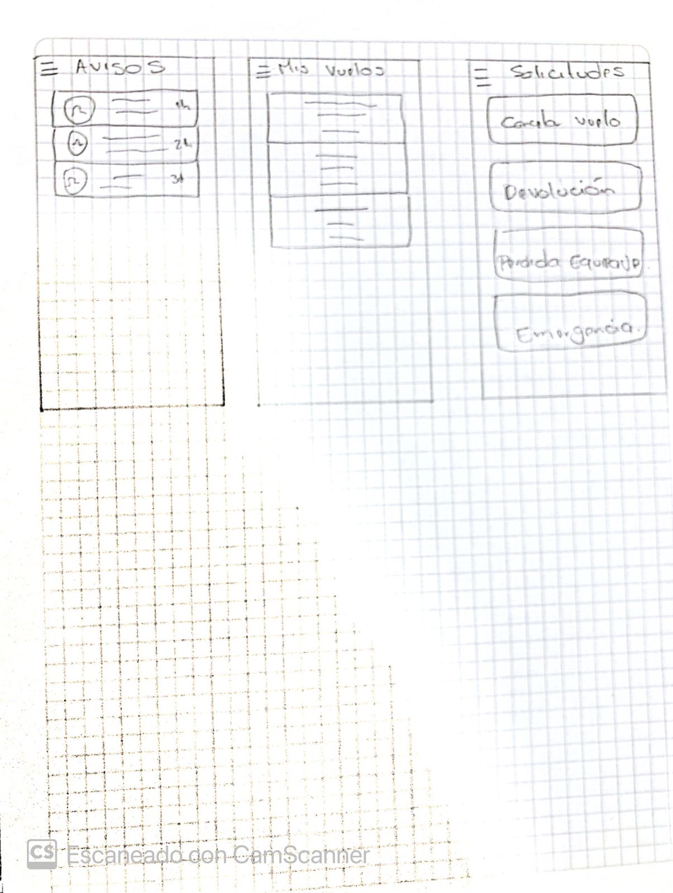

# DESARROLLO HU-2 UX/UI BASE

## Definición de colores 

Las gamas de colores seleccionados para el diseño de la aplicación son los siguientes:

- Azul: 030055
- Azul claro: D1D2E8
- Blanco: FFFFFF

## Definición Tipografía

Se utiliza una tipografía sencilla, legible para facilitar su lectura, también se utilizó en algunos casos el tipo de letra bold, los tamaños se redondean de (16 a 35). La tipografía selecciona fue: 

- Nunito
- Oleo Script Swash Caps

## Definición de Iconografía 

La iconografía seleccionada está acorde a la tonalidad de colores escogidos, también son fácil de reconocer para el usuario, estos son algunos de los iconos usados:

      

## Diseño Layout 

Se realizo el diseño Layout a mano para comprender sus funcionalidades y su arquitectura.

