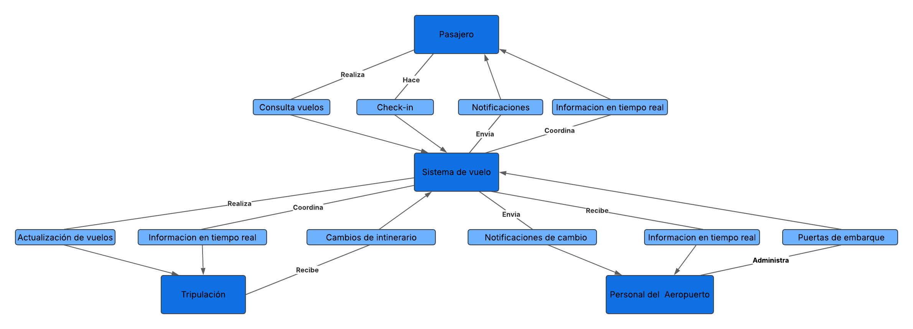

# EXPLICACIÓN DIAGRAMA DE PROCESO

La aplicación móvil de vuelos permite a los pasajeros, tripulación y personal del aeropuerto acceder a información en tiempo real, mejorando su coordición y evitando los retrasos.

El **pasajero** realiza consultas de vuelos, hace el chek-in y recibe notificaciones sobre cambios en su itinerario. En caso de cambios en horarios o puertas de embarque, el **sistema de vuelo** envía notificaciones automáticas.

La **tripulación** recibe cambios sobre itinerarios, coordina información en tiempo real como lo son las asignaciones de aerovanes y condiciones metereológicas.

El **personal del aeropuerto** administras las puertas de embarque y recibe información en tiempo real sobre los cambios en los vuelos.

El **sistema de vuelo** actúa como el nucleo del sistema, integrando y distribuyendo la informacion entre todos los actores.

# IMAGEN DEL DIAGRAMA DE PROCESO 

